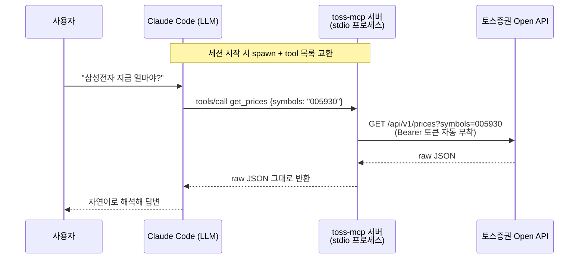

# toss-mcp

**토스증권 Open API를 Claude Code에서 자연어로 쓰게 해주는 로컬 MCP 서버**

```
나: 삼성전자 지금 얼마야?
Claude: [get_prices(symbols="005930") 호출]
        삼성전자는 현재 72,000원이고, 전일 대비 +1.4% 상승했습니다. (예시)

나: 내 잔고 보여줘
Claude: [get_accounts 호출 → accountSeq 획득 → get_holdings(accountSeq=1) 호출]
        보유 종목은 2개로, 총 평가금액은 ... (예시)
```

시세·잔고·환율·랭킹 등 **조회 전용 23개 tool**을 제공합니다. 주문 기능은 의도적으로 없습니다(아래 [설계](#설계-하이라이트) 참고).

---

## 동작 원리

MCP(Model Context Protocol) 서버는 네트워크 서버가 아니라, **stdin/stdout 파이프로 JSON-RPC를 주고받는 상주 프로세스**입니다 (LSP와 같은 아키텍처). Claude Code가 세션 시작 시 프로세스를 띄우고, 종료 시 함께 내립니다.



- LLM에게는 tool의 **이름·설명·입력 스키마만** 전달되고, 실행·인증은 전부 서버가 담당합니다.
- 여러 API가 필요한 질문("내 수익률은?")은 LLM이 tool을 **연쇄 호출**해 해결합니다. 조합 로직은 서버에 없습니다.

## 설계 하이라이트

1. **명세가 곧 코드** — [`openapi.json`](openapi.json)(토스증권 공식 명세)을 파싱해 tool을 자동 등록합니다. 엔드포인트별 코드가 없고, 토스가 API를 추가하면 명세 파일 교체만으로 tool이 늘어납니다. 23개 tool의 설명 문구도 전부 명세에서 옵니다.
2. **주문 불가는 코드 레벨 보장** — GET operation만 등록하므로 주문·정정·취소(POST/DELETE)는 tool 자체가 존재하지 않습니다. LLM이 실수하거나 오해해도 주문이 나갈 방법이 없습니다.
3. **얇은 랩핑** — 응답을 가공하지 않고 raw JSON 그대로 반환합니다. 해석은 LLM의 몫이고, 서버는 HTTP 전달자로 단순하게 유지됩니다.

설계 결정의 배경과 근거는 [CLAUDE.md](CLAUDE.md)에 기록되어 있습니다.

## 사전 준비

| 항목 | 비고 |
|---|---|
| Node.js 18+ | 20/22 LTS 권장 |
| 토스증권 계좌 | 앱에서 비대면 개설 |
| Open API 이용 승인 | 토스증권 WTS > 설정 > Open API에서 **사전신청** → 순차 승인 (2026년 7월 현재) |
| `client_id` / `client_secret` | 승인 후 같은 메뉴에서 발급 |
| **허용 IP 등록** | 같은 메뉴의 "허용 IP 관리" — 미등록 IP는 403 차단. 유동 IP면 변경 시 재등록 필요 |

## 설치와 등록

```bash
git clone <이 저장소> toss-mcp
cd toss-mcp
npm install
```

**1) 단독 검증 (Claude Code 연결 전 권장)**

```powershell
# 자격증명 없이도 서버 기동과 tool 목록까지는 확인 가능
npx @modelcontextprotocol/inspector npx tsx src/index.ts

# 자격증명이 있다면: .env.example을 .env로 복사해 실제 값 기입 후 (커밋 안 됨)
npx tsx scripts/smoke.ts
```

**2) Claude Code 등록**

자격증명은 서버가 프로젝트 루트의 `.env`에서 직접 읽으므로 등록 커맨드에 넣지 않습니다.

```bash
# Windows
claude mcp add toss-invest --scope user -- cmd /c npx tsx C:\절대경로\toss-mcp\src\index.ts

# macOS/Linux
claude mcp add toss-invest --scope user -- npx tsx /절대경로/toss-mcp/src/index.ts
```

등록 후 `claude mcp list`에서 `√ Connected`를 확인하고, 새 세션에서 자연어로 질문하면 됩니다.

## 제공 tool (23개, 전부 조회 전용)

| 카테고리 | tool | 예시 질문 |
|---|---|---|
| 시세 (5) | `get_prices`, `get_orderbook`, `get_trades`, `get_candles`, `get_price_limit` | "삼성전자 지금 얼마야", "최근 일봉 보여줘" |
| 종목 정보 (2) | `get_stocks`, `get_stock_warnings` | "이 종목 투자경고 걸려 있어?" |
| 시장 정보 (3) | `get_exchange_rate`, `get_kr_market_calendar`, `get_us_market_calendar` | "지금 환율은?", "오늘 미국장 열려?" |
| 랭킹 (1) | `get_rankings` | "오늘 거래량 상위 종목은?" |
| 시장 지표 (3) | `get_market_indicator_prices`, `get_market_indicator_candles`, `get_market_indicator_investor_trading` | "코스피 지수 어때?", "투자자별 매매동향은?" |
| 계좌·자산 (2) | `get_accounts`, `get_holdings` | "내 잔고 보여줘", "오늘 수익률은?" |
| 주문 조회 (7) | `get_orders`, `get_order`, `get_conditional_orders`, `get_conditional_order`, `get_buying_power`, `get_sellable_quantity`, `get_commissions` | "이번 달 체결 내역 보여줘", "매수 가능 금액은?" |

## 프로젝트 구조

```
src/
├─ index.ts       서버 조립 + stdio 연결 (진입점)
├─ registrar.ts   openapi.json 파싱 → GET만 필터 → tool 자동 등록
├─ schema.ts      명세 파라미터 → zod 스키마 변환
├─ handler.ts     전 tool 공유 generic handler
├─ tools/         (학습 기록) 자동화 이전에 손으로 작성한 tool 4개 — 미등록
└─ toss/
   ├─ auth.ts     TokenManager: OAuth2 토큰 발급·캐싱·선제 갱신
   └─ client.ts   TossClient: Bearer 부착, 401 시 1회 재발급 후 재시도
scripts/
└─ smoke.ts       서버 없이 토큰 발급 + API 1개 호출 검증
```

## 보안·주의사항

- 자격증명은 **환경 변수로만** 주입합니다. 코드·설정 파일·채팅에 secret을 남기지 마세요.
- 토스증권은 **client당 유효 토큰을 1개만** 허용합니다 (재발급 시 기존 토큰 즉시 무효화). 이 서버는 토큰을 캐싱하고 401 시 1회 재발급하도록 설계되어 있어, 다른 프로세스와 병행해도 자동 복구됩니다.
- 본 프로젝트는 개인 학습·조회 용도입니다. **이 도구가 제공하는 데이터에 기반한 투자 판단과 그 결과는 전적으로 사용자 본인의 책임입니다.**
- 토스증권 Open API의 이용약관 및 rate limit 정책을 준수하세요.

## 로드맵

- [ ] 일일 수익률 스냅샷 수집기 (`get_holdings`의 `dailyProfitLoss` → CSV 적재)
- [ ] 과거 수익률 근사 재구성 (주문 이력 + 일봉 + 환율)
- [ ] 주문 기능 opt-in 확장 (`TOSS_ENABLE_TRADING` 플래그 — 현재 계획 없음)

## 참고 자료

- [토스증권 Open API 공식 문서](https://developers.tossinvest.com/docs)
- [OpenAPI 명세 (공개)](https://openapi.tossinvest.com/openapi-docs/latest/openapi.json)
- [Model Context Protocol](https://modelcontextprotocol.io)
